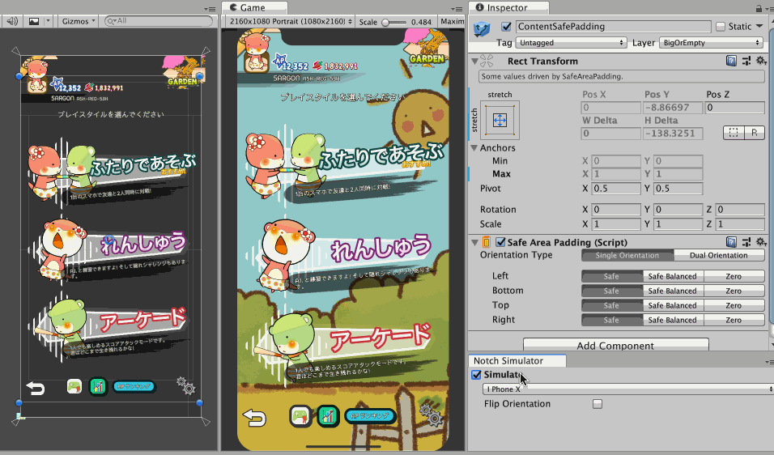
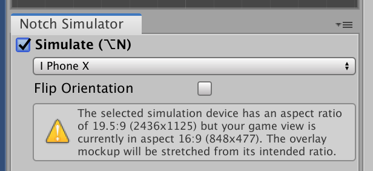
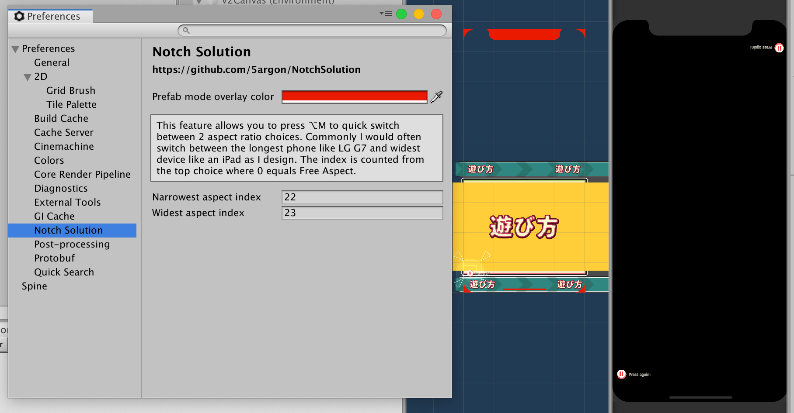

# Notch Solution

It is a set of tools to fight with notched/cutout phones for Unity uGUI. Minimum Unity version 2019.1.

## How to include with GitHub functionality of Unity Package Manager

Add this line `"com.e7.notch-solution": "git://github.com/5argon/NotchSolution.git",` to your `manifest.json`.

It does not update automatically when I push fixes to this repo. You must remove the lock line that appears in you `manifest.json` file to refectch. Otherwise you would better use Asset Store (when it is available)

## Reason for open source

I believe screen cutout problem must be solved collaboratively, since there are so many variations and potentially different permutation of problems. Over time we together could make this more stable than I could ever made alone.

The Discord channel [is also available here!](https://discord.gg/J4sCcj4) You could come and express your wishlist or issues. (You could also use the Issues section.)

## Asset Store

It will be on Unity Asset Store later too, but currently I don't think it is Asset Store worthy. There are some weird glitches remaining, and many usability issue related to the isolated prefab mode. (Prefab mode preview added in v1.2.0 but I am not sure of bugs)

# SafeAreaPadding

This script trust the return value of [`Screen.safeArea`](https://docs.unity3d.com/ScriptReference/Screen-safeArea.html) and pad the `RectTransform` accordingly.

## Android & `Screen.safeArea`

For Android to work, **your player's phone has to be on Android P AND also you have to use Unity 2019.1 or over**. Otherwise I believe Android builds with black bar over the notch/cutout (Maybe with [LAYOUT_IN_DISPLAY_CUTOUT_MODE_NEVER](https://developer.android.com/guide/topics/display-cutout/#never_render_content_in_the_display_cutout_area)) and non-Pie Android do not have a dedicated API to report cutouts.

## How it works

It can "drive" the `RectTransform` thanks to `ILayoutSelfController` and `UIBehaviour`. Meaning that several values will be greyed out so you can't modify it by mistake.

- You should attach this script to a direct child of top level `Canvas`, or a deeper child of full-canvas `RectTransform`.
- It will drive the anchor point to full stretch. The `RectTransform` now enters "offset from each side by how much" mode.
- `Screen.width/height` is divided by values from `Screen.safeArea`, producing relative safe area.
- Find root game object from the object with `SafeAreaPadding`. This should be your `Canvas`. It will ask for `RectTransform` coordinate from that `Canvas`.
- Then it will drive self's `RectTransform` other values according to relative safe area applied to `Canvas`'s `RectTransform`.

## `Screen.cutout` research started

New entry in **Unity 2019.2**, this time not just a safe area but it returns a rectangle **surrounding the notch**! Currently Notch Solution do not use this anywhere yet, but I am conducting a research to see what the phone reports for this property.

If you have a phone with cutouts, you could **join the research** by downloading a debug APK in the [release page](https://github.com/5argon/NotchSolution/releases). Then after running it on your phone, take a screenshot on both portrait and landscape orientation and submit your result in [this issue](https://github.com/5argon/NotchSolution/issues/2) so we know what it actually looks like, and we might be able to make use of it in the future! Thank you!

## Settings 

### Padding modes for each side

For each side in your current orientation, you can select from 3 modes.

- **Safe** : Pad this side according to `Screen.safeArea`.
- **Safe Balanced** : Pad this side according to `Screen.safeArea`, but if the opposite side has a larger padding then pad by that value instead.
- **Zero** : The padding will be zero, edge of your `RectTransform` will be locked to the canvas's edge.

### Orientation Type

If your application supports both portrait and landscape you could choose `DualOrientation` here. But such a game is rare so the default value is `SingleOrientation`. The choice will only show up if your Player Settings is configured such that both orientations are possible.

When you use `DualOrientation` your prior padding settings will become the portrait ones, and you will get a separated landscape paddings to setup. Your previous orientation will no longer applied to landscape orientation. If you switch back to `SingleOrientation` the portrait paddings works for both orientations again.

# Adaptation Components

For non-uGUI objects, sometimes there are controls waiting to be raycasted by something like `Physics2DRaycaster` to trigger the `EventSystem` just like UI objects. Notch could make those objects difficult to touch, but this time we have no help from uGUI layout system to move things out of the way.

How "adaptation" components works is that it could move things out of the way with help from animation Playables API. My design is that we will have 2 **single-frame** `AnimationClip` that represent "normal state" and "fully adapted state". These clips could control just about anything keyable, and the evaluated value could be blended anywhere between 2 clips.

It has one `AnimationCurve` graph called "adaptation curve". It should evaluates to 0 to 1 where 0 you get a normal state clip, and 1 you get fully-adapted clip. Now about the input to this curve, it depends on what kind of adaptation component.

## AspectRatioAdaptation

An adaptation where the value for curve evaluation came from screen aspect ratio number. The number is always assumed to be width/height regardless of game's orientation, so for example, it is always 1.3333 (4/3) for iPad. You could use this to **indirectly** fix notch problem, without knowing if the notch exists or not.

This gif demonstrate the problem of non uGUI objects when the aspect ratio changes. The camera shrink horizontally on narrower device when on portrait orientation. Before, I prepared a stage so that on iPad there are non-gameplay extra spaces around and could be cropped safely.

However this assumption is no longer safe with notch, since narrower device horizontally could have lesser vertical space with notch. It could make the control at vertical edges difficult to use.

With `AspectRatioAdaptation`, I could dynamically change anything according to aspect ratio number. Notice that nothing on the scene moves with notch on or off, because it adapts to aspect ratio and **indirectly** fix notch problem.

In this example, in addition to the camera narrowing normally by Unity, I could have it move a bit backwards with `AspectRatioAdaptation`. Because of perspective settings, moving a camera backwards will make room on the top and bottom and in turn, make a space for notch. We have avoided the notch without querying for an existence of notch this way.

Additionally, you see that the stage itself expands vertically a bit too as a finishing touch. This affects gameplay a bit but overall looks nicer on narrow device than using the same stage shape as iPad aspect ratio.

The 2 clips on the camera in this example are each just a single frame keyed as `z = 13` for normal state and `z = 16` for fully-adapted state. The `adaptationCurve` is set so that time 1.3333 evaluates to 0, and time 2.1667 evaluates to 1. And 1.3333 is an iPad's aspect ratio, so it get fully normal state clip. If you use iPhone SE which has 16:9 ratio (1.7778), you would get somewhere between these 2 clips. (2.1667 is calculated from LG G7's ratio.) You can see at the corner that `z` is really -13 when the game view is on iPad aspect.

## SafeAreaAdaptation

This is like `AspectRatioAdaptation` but this time we could adapt directly to **relative screen space taken** by a **single side** of safe area.

# Notch Simulator

Accessible from `Window > General > Notch Simulator`. Additionally with Shortcuts API introduced in 2019.1, you could press `Alt/Option + N` to toggle it to confirm your design. It could be adjusted in the `Shortcuts...` preference menu.

Works together with all `INotchSimulatorTarget` (`SafeAreaPadding` is one of them) in the current scene and prefab environment scene. Normally `Screen.safeArea` does not return a useful value in editor. Notch Simulator can simulate a safe area in editor for you **even in prefab mode**. You can toggle it on and off to see your UI reacts immediately.

Non-flipped orientation of landscape is assumed to be "landscape left" from natural portrait orientation.

## How it works

- The simulator maintains 2 `Canvas` game objects, one in the normal scene and one in the prefab environment scene. They are with `HideFlags` that make it invisible on Hierarchy and do not get saved.
- `AssetDatabase` search the plugin folder for the correct notch overlay image to put in that canvas. Portrait and landscape image is separated. (For example iPhoneX has a different bottom bar.)
- This `Canvas` is on "Screen Space - Overlay". with high sort order.
- You need to set the game view to match your simulation device choice or it would looks weird.
- Portrait or landscape orientation is determined from width vs height of the current game view's size. (Not by `Screen.` API, since that does not work in editor.)
- All `INotchSimulatorTarget` found will be sent a simulated `Rect`. Static access point to the latest simulated rect is also available with `NotchSolutionUtility.SimulateSafeAreaRelative` if passing around that `Rect` is a hassle. You could write your own extension that links with the simulator this way.

The overlay is also useful for aiming roughly what can fit in the corner around the notch, because you can see the notch's width and also rounded corner visually where safe area does not cover such information. (Safe area is a rectangle.) Although please note that Apple advise agaist intentionally trying to design on that gap.

2019.2's `Screen.cutouts` could precisely cover the cutout area, but no work has been put to utilize that yet.

## Preferences

There is a preference menu available. For example you could change prefab mode overlay color to be different from Game view ones, or enable some other extra toolings.

# How-to and tricks

They are now collected [in this document](.Documentation/HowTo.md).

# Need help / TODO

Please see the Issue section.

# How to contribute a new simulation device

- Download APK in the **Build** folder. Then install on your Android with file manager or `adb install -r` (r = replace). After it runs, **rotate the device to both portrait and landscape** and take screenshots to remember informations.
- `Editor/SimulationDevice.cs` : Add a new `enum` to this file first. It would show up in the simulator with `enum` dropdown.
- `Editor/SimulationDatabase.cs` : A mapping from that `enum` to various information required.
- `Editor/Mockups` : Mockup overlay files are here. It should be named this pattern `NoSo-{enum}-{Portrait/Landscape}` and colored white/transparent. It can be in any resolution but needs to be aspect-correct as it will be stretched out to the `Canvas`.

## Current simulation devices available

- iPhone X
- iPad Pro

(Contributed by [06Games](https://github.com/06Games))

- Huawei Mate 20 Pro 
- OnePlus 6T
- Samsung Galaxy S10
- Samsung Galaxy S10+

# This asset is sponsored by

My own other (paid) assets... haha. Asides from code contribution, you could also provide support by getting something from these. Thank you.

- [Introloop](http://exceed7.com/introloop/) - Easily play looping music with intro section (without physically splitting them) (Unity 2017.0+)
- [Native Audio](http://exceed7.com/native-audio/) - Lower audio latency via OS's native audio library. (Unity 2017.1+, iOS uses OpenAL / Android uses OpenSL ES)
- [Native Touch](http://exceed7.com/native-touch/) - Faster touch via callbacks from the OS, with a real hardware timestamp. (Unity 2017.1+, iOS/Android)

The game at the top is [Duel Otters/ตัวนากท้าดวล/かわうそバトル](http://exceed7.com/duel-otters).

One another is an in-development game [Mel Cadence/メルカデンツ](http://exceed7.com/mel-cadence).
