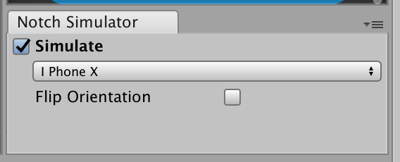

# Notch Solution

It is a set of tools to fight with notched/cutout phones for Unity uGUI.

## How to include with GitHub functionality of Unity Package Manager

Add this line `"com.e7.notch-solution": "git://github.com/5argon/NotchSolution.git",` to your packages.json

It does not update automatically when I push fixes to this repo. You must remove the lock in your Packages folder. Otherwise you would better use Asset Store.

## Asset Store

It will be on Unity Asset Store for free later. There are some weird glitches remaining...

# SafeAreaPadding

This script trust the return value of [`Screen.safeArea`](https://docs.unity3d.com/ScriptReference/Screen-safeArea.html) and pad the `RectTransform` accordingly.

## Android & `Screen.safeArea`

For Android to work, your player's phone has to be on Android P AND also you have to use Unity 2019.1 or over. Otherwise I believe Android builds with black bar over the notch/cutout.

## How it works

It can "drive" the `RectTransform` thanks to `ILayoutSelfController` and `UIBehaviour`. Meaning that several values will be greyed out so you can't modify it by mistake.

- You should attach this script to a direct child of top level `Canvas`, or a deeper child of full-canvas `RectTransform`.
- It will drive the anchor point to full stretch. The `RectTransform` now enters "offset from each side by how much" mode.
- `Screen.width/height` is divided by values from `Screen.safeArea`, producing relative safe area.
- Find root game object from the object with `SafeAreaPadding`. This should be your `Canvas`. It will ask for `RectTransform` coordinate from that `Canvas`.
- Then it will drive self's `RectTransform` other values according to relative safe area applied to `Canvas`'s `RectTransform`.

## Settings 

### Padding modes for each side

For each side in your current orientation, you can select from 3 modes.

- **Safe** : Pad this side according to `Screen.safeArea`.
- **Safe Balanced** : Pad this side according to `Screen.safeArea`, but if the opposite side has a larger padding then pad by that value instead.
- **Zero** : The padding will be zero, edge of your `RectTransform` will be locked to the canvas's edge.

"Safe Balanced" is for example, you are making a landscape orientation game and there are left and right arrows which supposed to stick to the left and right edge of the screen. With notch present, according to safe area only one side will move in which might looks odd depending on your game. You then may use `Safe` on the notch side and `SafeBalanced` on the opposite side to offset the non-notch side by the same amount.

### Orientation Type

If your application supports both portrait and landscape you could choose `DualOrientation` here. But such a game is rare so the default value is `SingleOrientation`.

When you use `DualOrientation` your prior padding settings will become the portrait ones, and you will get a separated landscape paddings to setup. Your previous orientation will no longer applied to landscape orientation. If you switch back to `SingleOrientation` the portrait paddings works for both orientations again.

# Notch Simulator

Accessible from `Window > General > Notch Simulator`. 

Works together with all `SafeAreaPadding` in the current scene. Normally `Screen.safeArea` does not return a useful value in editor. Notch Simulator can simulate a safe area in editor for you even outside of play mode. You can toggle it on and off to see your UI reacts immediately.

## How it works

- The simulator maintains a `Canvas` game object with hide flags invisible and not save in any circumstance.
- `AssetDatabase` search the plugin folder for the correct notch overlay image to put in that canvas. Portrait and landscape image is separated. (For example iPhoneX has a different bottom bar.)
- This `Canvas` is on "Screen Space - Overlay". with high sort order.
- You need to set the game view to match your simulation device choice or it would looks weird.
- Portrait or landscape orientation is determined from width vs height of the current game view's size. (Not by `Screen.` API, since that does not work in editor.)

This is also useful for aiming what can fit in the corner around the notch. Safe area do not cover such information. (Safe area is a rectangle)

# Need help / TODO

- Wait for 2019.1 then we can have the "eye" visibility toggle in the hierarchy. The simulator-created notch overlay should have this visibility as off so it is invisible in Scene view but visible in the game view.
- Wait for 2019.1 and add some shortcut keys to toggle the simulator.
- Make an APK for grabbing `Screen.safeArea` for distribution. (Or even use some kind of web service to collect safe areas automatically.)
- Add more profiles and mockup overlays, but I need someone with notch/cutout phone and try calling `Screen.safeArea` on the phone. Contribution of overlay image would be appreciated, see examples in `Editor/Mockups` folder. It can be in any resolution but needs to be aspect-correct as it will be stretched out to the `Canvas`.

## How to add a new device

- `Editor/SimulationDevice.cs` : Add a new `enum` to this file first. It would show up in the simulator with enum dropdown.
- `Editor/SimulationDatabase.cs` : A mapping from that `enum` to various information required.
- `Editor/Mockups` : Mockup overlay files are here. It should be named this pattern `NoSo-{enum}-{orientation}` and colored white.